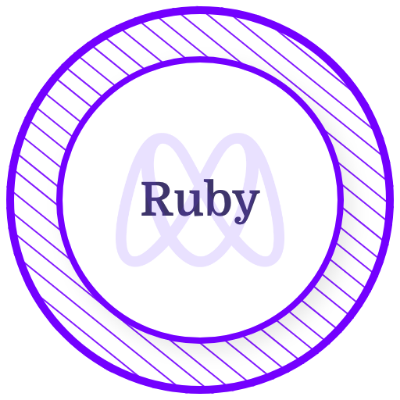

<h1 align="left">
Hi there! 👋 I'm Mavericks 
</h1>

👨‍💻 Full Stack Web Developer (MERN) from Philippines 🇵🇭

🌐 Check out my [portfolio](https://mavericks-db.com/).

💬 Chat me on Discord: [mavericks-db#4521](https://discord.com/).

<h2 align="left"> 📬 Contact me at : </h2>

<h2 align ="left">🛠️ Tech Stack : </h2>

<h2 align ="left">⚡ Stats :

  
  

<!-- <h2>Weekly Coding Stats</h2>

 -->

  
 Microverse Certificates

<table align="center">
  <tr>
  <td align="center"></td>
  <td align="center"></td>
    <td align="center"></td>
    <td align="center"></td>
    <td align="center"></td>
    <td align="center"></td>
    <td align="center"></td>
  </tr>
</table>

  
 DataCamp Certificates

<table align="center">
  <tr>
    <td align="center"></td>
  </tr>
</table>

---

<em>Let's connect and forge the future together! 🚀 <em>

